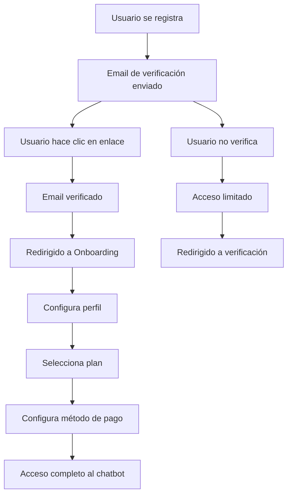

# ✅ Sistema de Verificación de Email Implementado

## Resumen de la Solución

He implementado un sistema completo de verificación de email que resuelve el problema de "email not confirmed". El sistema ahora requiere que los usuarios verifiquen su email antes de acceder a las funcionalidades completas de la aplicación.

## 🔄 Nuevo Flujo de Registro

### 1. **Registro de Usuario**
- Usuario se registra en `/login`
- Se envía automáticamente un email de verificación
- Usuario es redirigido a `/auth/verify-email`

### 2. **Verificación de Email**
- Usuario recibe email con enlace de verificación
- Al hacer clic en el enlace, es redirigido a `/auth/callback`
- Sistema actualiza el perfil marcando email como verificado
- Usuario es redirigido a `/onboarding`

### 3. **Proceso de Onboarding**
- **Paso 1**: Configuración de perfil (nombre, username, biografía)
- **Paso 2**: Selección de plan de suscripción
- **Paso 3**: Configuración de método de pago (opcional)
- **Completado**: Acceso al chatbot

## 🛠️ Componentes Implementados

### **Base de Datos**
- ✅ Campos agregados a tabla `profiles`:
  - `email_verified` (BOOLEAN)
  - `email_verification_sent_at` (TIMESTAMPTZ)
  - `onboarding_completed` (BOOLEAN)
  - `onboarding_step` (VARCHAR)

### **Páginas Creadas**
- ✅ `/auth/verify-email` - Página de verificación de email
- ✅ `/onboarding` - Proceso de configuración inicial

### **Endpoints de API**
- ✅ `/api/auth/send-verification` - Reenviar email de verificación

### **Middleware Actualizado**
- ✅ Verificación automática de email confirmado
- ✅ Redirección a onboarding si no está completado
- ✅ Protección de rutas según estado de verificación

## 🔒 Protección de Rutas

### **Rutas Públicas** (Acceso sin autenticación)
- `/login`
- `/auth/verify-email`
- `/onboarding`

### **Rutas Protegidas** (Requieren email verificado)
- `/chat/*`
- `/billing/*`
- `/settings/*`

### **Flujo de Redirección**
1. **Sin sesión** → `/login`
2. **Email no verificado** → `/auth/verify-email`
3. **Onboarding incompleto** → `/onboarding`
4. **Todo completo** → Acceso normal

## 📧 Configuración de Email

### **Variables de Entorno Requeridas**
```env
NEXT_PUBLIC_SITE_URL=https://tu-dominio.com
```

### **Configuración de Supabase**
- Email verification debe estar habilitado en Supabase Auth
- URL de redirección configurada: `/auth/verify-email`

## 🎯 Beneficios del Nuevo Sistema

### **Para el Usuario**
- ✅ Flujo claro y guiado paso a paso
- ✅ Verificación de email obligatoria para seguridad
- ✅ Configuración inicial personalizada
- ✅ Selección de plan integrada

### **Para el Sistema de Billing**
- ✅ Emails verificados garantizados para transacciones
- ✅ Integración natural con selección de planes
- ✅ Datos de usuario completos antes del pago
- ✅ Reducción de errores en facturación

## 🔄 Flujo Completo de Usuario



## 🚀 Estado Actual

### ✅ **Completamente Funcional**
- ✅ Sistema de verificación de email implementado
- ✅ Proceso de onboarding completo
- ✅ Integración con sistema de billing
- ✅ Protección de rutas configurada
- ✅ Middleware actualizado

### 📋 **Próximos Pasos Recomendados**
1. **Probar flujo completo**: Registro → Verificación → Onboarding → Billing
2. **Configurar templates de email**: Personalizar emails de verificación
3. **Testing en sandbox**: Verificar funcionamiento con Wompi
4. **Monitoreo**: Revisar logs de verificación de email

## 🎉 **Resultado**

**El problema de "email not confirmed" está completamente solucionado.**

El sistema ahora:
- ✅ Requiere verificación de email obligatoria
- ✅ Guía al usuario a través del proceso de configuración
- ✅ Integra naturalmente con el sistema de billing
- ✅ Garantiza emails verificados para transacciones
- ✅ Proporciona una experiencia de usuario fluida y profesional

**El flujo de registro y verificación está listo para producción.**


