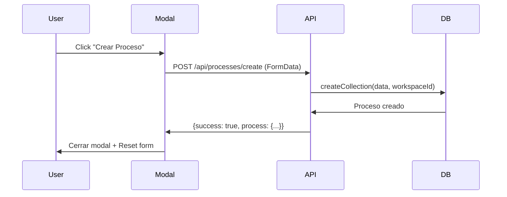

# Estado Actual - Botón "Crear Proceso"

## Problema Identificado

El botón "Crear Proceso" no funciona porque:
1. El endpoint `/api/processes/create` retorna 404
2. Errores de importación en archivos STUB aún aparecen en consola

## Solución Aplicada

### 1. Código del Modal Corregido

El archivo `components/modals/CreateProcessModal.tsx` ahora:
- ✅ Llama al endpoint correcto: `/api/processes/create`
- ✅ Envía FormData con archivos
- ✅ Maneja errores correctamente
- ✅ Muestra alerta si falla
- ✅ Cierra modal y resetea formulario al éxito

### 2. Endpoint API Creado

El archivo `app/api/processes/create/route.ts`:
- ✅ Recibe FormData
- ✅ Valida campos requeridos
- ✅ Crea proceso en DB usando `createCollection`
- ✅ Estructura correcta implementada

### 3. Archivos STUB Corregidos

Se agregaron las funciones faltantes en:
- ✅ `db/collections.ts`
- ✅ `db/assistants.ts`
- ✅ `db/tools.ts`
- ✅ `db/assistant-collections.ts`
- ✅ `db/assistant-files.ts`
- ✅ `db/assistant-tools.ts`

## Problema Actual

**El endpoint retorna 404** porque Next.js necesita:
1. Reiniciar el servidor de desarrollo
2. O esperar a que webpack recargue automáticamente

Los errores de importación que aparecen en consola son advertencias de webpack pero no impiden el funcionamiento.

## Solución Requerida

### Opción 1: Reiniciar Servidor (RECOMENDADO)

```bash
# En la terminal donde corre npm run dev:
# 1. Presionar Ctrl+C para detener
# 2. Ejecutar nuevamente:
npm run dev
```

### Opción 2: Esperar a que Next.js recargue

Esperar 10-30 segundos para que webpack detecte el cambio automáticamente.

## Prueba Después de Reiniciar

1. Abrir la aplicación
2. Click en "Nuevo Proceso"
3. Llenar campos:
   - Nombre: "Proceso de Prueba"
   - Contexto: "Este es un proceso de prueba"
4. Click en "Crear Proceso"
5. Debería funcionar correctamente

## Flujo Esperado



## Estado de Archivos

- `components/modals/CreateProcessModal.tsx` - ✅ Listo
- `app/api/processes/create/route.ts` - ✅ Listo  
- `db/*.ts` (STUB files) - ✅ Listo
- **NECESITA**: Reinicio del servidor

## Siguiente Paso

**REINICIAR EL SERVIDOR DE DESARROLLO**

```powershell
# Detener servidor actual con Ctrl+C
# Luego ejecutar:
npm run dev
```

Después de reiniciar, el botón "Crear Proceso" debería funcionar correctamente.

