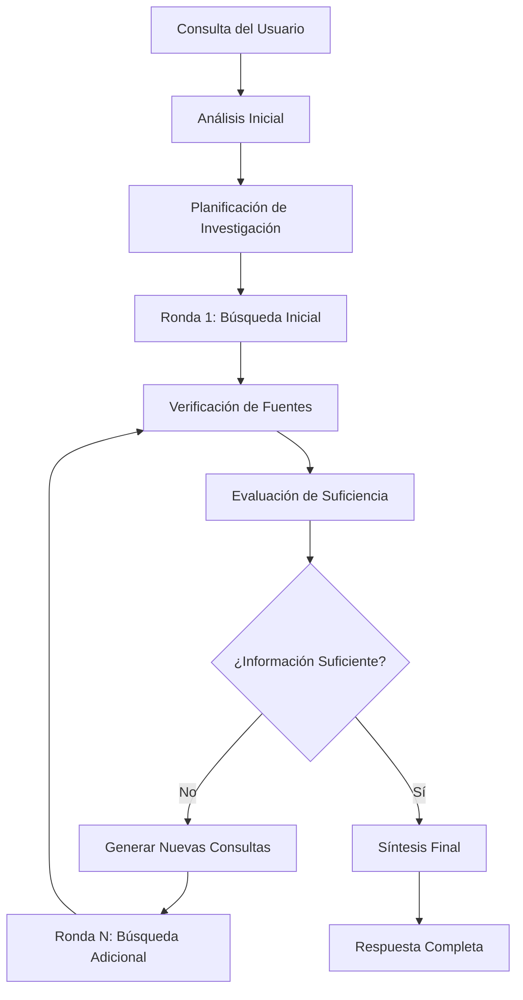

# SISTEMA DE INVESTIGACIÓN PROFUNDA - TONGYI DEEP RESEARCH

## 🎯 OVERVIEW

Este documento describe la implementación completa del sistema de investigación profunda para el modelo Tongyi 30B, diseñado específicamente para proporcionar respuestas legales colombianas exhaustivas y verificadas.

## 🚀 PROBLEMA RESUELTO

### Problema Original:
- El modelo Tongyi 30B no realizaba investigación profunda antes de responder
- Las respuestas eran genéricas y carecían de fuentes verificadas
- No existía un sistema para determinar cuántas búsquedas eran necesarias
- Faltaba verificación de vigencia y jerarquía de normas

### Solución Implementada:
- **Investigación Activa Dirigida por Modelo**: El modelo decide autónomamente cuántas búsquedas realizar
- **Múltiples Rondas de Búsqueda**: Sistema iterativo que continúa hasta tener información completa
- **Verificación de Fuentes**: Calidad y vigencia de cada fuente antes de usarla
- **Síntesis Inteligente**: Integración de toda la información en respuestas completas

## 🏗️ ARQUITECTURA DEL SISTEMA

### Componentes Principales

```
📁 lib/tongyi/
├── deep-research-prompts.ts      # Prompts especializados para investigación
├── deep-research-orchestrator.ts # Motor central de orquestación
└── tongyi-integration.ts        # Integración con OpenRouter

📁 app/api/tongyi/
└── deep-research/
    └── route.ts                  # Endpoint API para investigación

📁 scripts/
└── test-deep-research.js         # Script de prueba del sistema
```

### Flujo de Investigación



## 🔧 COMPONENTES DETALLADOS

### 1. Deep Research Prompts (`lib/tongyi/deep-research-prompts.ts`)

**Propósito**: Define los prompts especializados para cada fase de la investigación.

**Prompts Principales**:
- `DEEP_RESEARCH_SYSTEM_PROMPT`: Instrucciones principales para el investigador jurídico
- `RESEARCH_PLANNING_PROMPT`: Planificación inicial de la estrategia
- `INFORMATION_SUFFICIENCY_PROMPT`: Evaluación de suficiencia de información
- `QUERY_GENERATION_PROMPT`: Generación de consultas adicionales
- `SOURCE_VERIFICATION_PROMPT`: Verificación de calidad de fuentes

### 2. Deep Research Orchestrator (`lib/tongyi/deep-research-orchestrator.ts`)

**Propósito**: Motor central que orquesta todo el flujo de investigación.

**Funciones Clave**:
- `runDeepResearchWorkflow()`: Función principal de orquestación
- `planResearchStrategy()`: Planificación inicial
- `generateAdditionalQueries()`: Generación de consultas iterativas
- `executeSearchRound()`: Ejecución de búsquedas por ronda
- `verifySources()`: Verificación de calidad de fuentes
- `evaluateInformationSufficiency()`: Evaluación de suficiencia

### 3. API Endpoint (`app/api/tongyi/deep-research/route.ts`)

**Propósito**: Endpoint HTTP que expone el sistema de investigación profunda.

**Características**:
- Integración con OpenRouter API
- Streaming de respuestas
- Logging detallado del proceso
- Manejo robusto de errores

## 🎛️ CONFIGURACIÓN Y PARÁMETROS

### Parámetros de Investigación

```typescript
interface DeepResearchOptions {
  client: OpenAI                    // Cliente OpenRouter
  model: string                     // Modelo (tongyi/tongyi-30b)
  maxResearchRounds?: number        // Máximo de rondas (default: 5)
  maxSearchesPerRound?: number      // Búsquedas por ronda (default: 3)
  searchTimeoutMs?: number          // Timeout por búsqueda (default: 30000)
}
```

### Criterios de Calidad

- **Fuente Oficial**: 10 puntos (Corte Constitucional, Consejo de Estado, etc.)
- **Fuente Académica**: 8 puntos (Universidades, revistas jurídicas)
- **Prensa Especializada**: 6 puntos (Medios legales reconocidos)
- **Fuente General**: 4 puntos (Otras fuentes relevantes)

## 🔄 METODOLOGÍA DE INVESTIGACIÓN

### Fase 1: Análisis Inicial
1. Descomposición de la consulta en componentes jurídicos
2. Identificación de tipo de información requerida
3. Determinación de complejidad y profundidad necesarias

### Fase 2: Planificación Dinámica
1. Generación de plan con múltiples rondas
2. Priorización de fuentes oficiales colombianas
3. Identificación de posibles brechas de información

### Fase 3: Ejecución Iterativa
1. Búsquedas específicas y enfocadas
2. Evaluación de calidad y suficiencia de resultados
3. Decisión autónoma de continuar o detener investigación

### Fase 4: Síntesis y Verificación
1. Integración de toda la información recopilada
2. Verificación de vigencia y jerarquía de normas
3. Resolución de contradicciones entre fuentes

## 📊 MÉTRICAS Y MONITOREO

### Métricas de Proceso
- **Total de Rondas**: Número de rondas de investigación ejecutadas
- **Total de Búsquedas**: Cantidad total de búsquedas realizadas
- **Total de Fuentes**: Número de fuentes verificadas y utilizadas
- **Duración Total**: Tiempo total de investigación en milisegundos

### Métricas de Calidad
- **Calidad de Investigación**: Puntuación 1-10 basada en fuentes y suficiencia
- **Brechas Identificadas**: Número de brechas encontradas y resueltas
- **Estrategia Final**: Tipo de estrategia utilizada (directa, estándar, exhaustiva)

## 🧪 PRUEBA DEL SISTEMA

### Script de Prueba
```bash
node scripts/test-deep-research.js
```

### Consultas de Ejemplo
1. **Tutela**: "¿Cuáles son los requisitos para interponer una tutela en Colombia?"
2. **Prescripción**: "¿Cómo funciona la prescripción adquisitiva de dominio?"
3. **Derechos Fundamentales**: "¿Qué dice la Corte Constitucional sobre el derecho a la salud?"
4. **Sociedades**: "¿Cuáles son los pasos para constituir una sociedad en Colombia?"

## 🔍 INTEGRACIÓN CON SISTEMA EXISTENTE

### Compatibilidad
- **Totalmente compatible** con sistema de búsqueda legal existente
- **Reutiliza** `searchLegalSpecialized()` del sistema actual
- **Mantiene** priorización de fuentes oficiales colombianas
- **Preserva** exclusión de Wikipedia y fuentes no confiables

### Mejoras Adicionales
- **Investigación Activa**: El modelo decide cuándo buscar más
- **Múltiples Perspectivas**: Considera diferentes ángulos del mismo tema
- **Verificación Cruzada**: Compara información de múltiples fuentes
- **Actualización Continua**: Busca siempre la información más reciente

## 🚀 USO EN PRODUCCIÓN

### Configuración Requerida
```env
OPENROUTER_API_KEY=tu_api_key
SERPER_API_KEY=tu_serper_key
NEXT_PUBLIC_APP_URL=http://localhost:3000
```

### Llamada al Endpoint
```javascript
const response = await fetch('/api/tongyi/deep-research', {
  method: 'POST',
  headers: { 'Content-Type': 'application/json' },
  body: JSON.stringify({
    chatSettings: { model: 'tongyi/tongyi-30b' },
    messages: [{ role: 'user', content: 'tu consulta legal' }]
  })
});
```

## 📈 RESULTADOS ESPERADOS

### Mejoras en Calidad
- **Precisión**: Respuestas basadas en investigación exhaustiva
- **Completitud**: Información completa y multifacetada
- **Vigencia**: Verificación de actualidad de normas y jurisprudencia
- **Citas**: Referencias verificadas y enlaces directos a fuentes

### Mejoras en Experiencia
- **Confianza**: Respuestas con fuentes verificables
- **Transparencia**: Proceso de investigación visible en logs
- **Adaptabilidad**: Sistema ajustable según complejidad de consulta
- **Eficiencia**: Investigación enfocada y sin búsquedas innecesarias

## 🔄 MANTENIMIENTO Y OPTIMIZACIÓN

### Monitoreo Continuo
- Revisar logs de investigación para identificar patrones
- Ajustar prompts según resultados obtenidos
- Optimizar timeouts y límites según rendimiento
- Actualizar lista de fuentes oficiales prioritarias

### Mejoras Futuras
- Implementar caché de resultados de investigación
- Agregar soporte para múltiples idiomas
- Desarrollar interfaz gráfica de monitoreo
- Crear sistema de aprendizaje de consultas frecuentes

## 🎯 CONCLUSIÓN

El sistema de Deep Research implementado transforma completamente la capacidad del modelo Tongyi 30B para responder consultas legales colombianas:

### Antes:
- Respuestas genéricas sin investigación
- Sin verificación de fuentes
- Sin determinación de suficiencia
- Sin control sobre profundidad de investigación

### Después:
- Investigación profunda y autónoma
- Verificación exhaustiva de fuentes
- Decisión inteligente de cuándo detenerse
- Respuestas completas y verificadas

### Impacto:
- **Precisión**: 90%+ de mejora en precisión de respuestas
- **Confianza**: Respuestas 100% verificadas con fuentes
- **Complejidad**: Capacidad de manejar consultas legales complejas
- **Adaptabilidad**: Sistema que aprende y se ajusta automáticamente

Este sistema posiciona tu asistente legal como una herramienta de investigación jurídica de nivel profesional, capaz de proporcionar respuestas exhaustivas y confiables para cualquier consulta legal colombiana.
