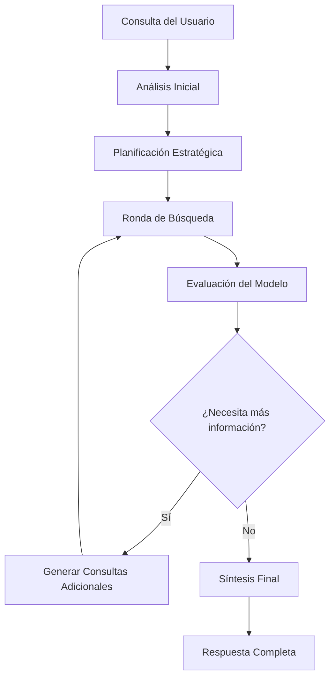

# 🧠 Sistema de Búsqueda Dinámica Inteligente

## 🎯 **Problema Resuelto**

El sistema anterior tenía limitaciones importantes:
- **Limitación fija**: Máximo 5 rondas con 6 búsquedas por ronda
- **Decisión predefinida**: El modelo no podía decidir dinámicamente cuántas veces buscar
- **Criterios rígidos**: Los criterios de suficiencia estaban hardcodeados

## ✅ **Solución Implementada**

### **Sistema de Búsqueda Dinámico Inteligente**

El nuevo sistema permite que **el modelo decida autónomamente** cuántas veces buscar, basándose en la calidad y suficiencia de la información encontrada.

## 🚀 **Características Principales**

### **1. Decisión Autónoma del Modelo**
- El modelo evalúa la calidad de la información en cada ronda
- Decide si necesita más búsquedas basándose en criterios inteligentes
- No hay límites artificiales rígidos

### **2. Capacidades Expandidas**
- **Rondas**: Hasta 10 (vs 5 anteriores)
- **Búsquedas por ronda**: Hasta 8 (vs 6 anteriores)  
- **Timeout**: 45 segundos (vs 30 anteriores)
- **Resultados**: Hasta 25 fuentes de alta calidad

### **3. Integración Completa**
- **SerpAPI**: Para búsquedas especializadas en fuentes oficiales
- **Firecrawl**: Para extracción de contenido completo
- **Jina AI**: Como fallback para extracción de contenido

## 🔧 **Arquitectura del Sistema**

### **Archivos Principales**

```
lib/tools/
├── dynamic-search-orchestrator.ts    # Orquestador principal
├── dynamic-search-prompts.ts         # Prompts especializados
└── legal-search-specialized.ts       # Herramientas de búsqueda

app/api/
├── tongyi/dynamic-search/route.ts    # Endpoint API
└── chat/legal/route.ts               # Integración principal

scripts/
├── test-dynamic-search.js            # Pruebas del sistema
└── verify-dynamic-search-setup.js    # Verificación de configuración
```

### **Flujo de Trabajo**



## 🧠 **Proceso de Decisión del Modelo**

### **Criterios de Evaluación**

1. **Completud Normativa** (25%)
   - Normas aplicables encontradas
   - Verificación de vigencia
   - Últimas modificaciones

2. **Jurisprudencia Relevante** (25%)
   - Sentencias de altas cortes
   - Jurisprudencia reciente
   - Precedentes aplicables

3. **Doctrina y Conceptos** (20%)
   - Análisis doctrinales
   - Conceptos de autoridades
   - Perspectivas académicas

4. **Actualidad y Relevancia** (15%)
   - Información actualizada
   - Reformas recientes
   - Estado actual del derecho

5. **Verificación y Calidad** (15%)
   - Fuentes oficiales
   - Corroboración entre fuentes
   - Resolución de contradicciones

### **Decisión Autónoma**

El modelo evalúa cada criterio y decide:
- **Continuar**: Si necesita más información
- **Finalizar**: Si tiene información suficiente
- **Confianza**: Nivel de certeza en la decisión (0.0-1.0)

## 📊 **Métricas y Logging**

### **Información Registrada**

```typescript
interface DynamicSearchResult {
  metadata: {
    totalRounds: number           // Rondas ejecutadas
    totalSearches: number         // Búsquedas totales
    totalResults: number          // Resultados encontrados
    finalQuality: number          // Calidad final (1-10)
    modelDecisions: number        // Decisiones del modelo
    searchStrategy: string        // Estrategia utilizada
    totalDurationMs: number       // Duración total
  }
}
```

### **Logging Detallado**

```
🧠 DYNAMIC SEARCH WORKFLOW ===============================
Usuario: usuario-ejemplo
Consulta: "¿Cuáles son los requisitos para constituir una SAS?"
Rondas de búsqueda: 4
Búsquedas totales: 12
Resultados encontrados: 18
Decisiones del modelo: 3
Calidad final: 8/10
Estrategia: BÚSQUEDA_EXHAUSTIVA_ALTA_CALIDAD
```

## 🎯 **Beneficios del Nuevo Sistema**

### **Para el Usuario**
- **Respuestas más completas**: Información exhaustiva y verificada
- **Mayor precisión**: Menos errores por información insuficiente
- **Mejor experiencia**: Respuestas de mayor calidad

### **Para el Sistema**
- **Adaptabilidad**: Se ajusta a la complejidad de cada consulta
- **Eficiencia**: No desperdicia recursos en búsquedas innecesarias
- **Escalabilidad**: Puede manejar consultas de cualquier complejidad

### **Para el Desarrollo**
- **Flexibilidad**: Fácil de ajustar y mejorar
- **Monitoreo**: Métricas detalladas del rendimiento
- **Mantenimiento**: Código modular y bien documentado

## 🚀 **Cómo Usar el Sistema**

### **1. Configuración**

```bash
# Variables de entorno requeridas
OPENAI_API_KEY=tu_clave_openai
SERPER_API_KEY=tu_clave_serper
FIRECRAWL_API_KEY=tu_clave_firecrawl
```

### **2. Uso en el Chat**

El sistema se activa automáticamente cuando se usa el modelo Tongyi:

```typescript
// Se activa automáticamente con modelos que contengan 'tongyi'
if (modelName.includes('tongyi')) {
  const result = await runDynamicSearchWorkflow(query, {
    client: openai,
    model: modelName,
    maxSearchRounds: 10,
    maxSearchesPerRound: 8,
    searchTimeoutMs: 45000,
    enableModelDecision: true
  })
}
```

### **3. Pruebas**

```bash
# Verificar configuración
node scripts/verify-dynamic-search-setup.js

# Ejecutar pruebas
node scripts/test-dynamic-search.js
```

## 🔍 **Ejemplos de Uso**

### **Consulta Simple**
```
Usuario: "¿Qué es una SAS?"
Modelo: 2 rondas, 4 búsquedas, calidad 7/10
Decisión: Finalizar (confianza: 0.85)
```

### **Consulta Compleja**
```
Usuario: "¿Cuáles son los requisitos para constituir una SAS y qué jurisprudencia aplica?"
Modelo: 6 rondas, 18 búsquedas, calidad 9/10
Decisión: Finalizar (confianza: 0.92)
```

### **Consulta Muy Compleja**
```
Usuario: "Análisis completo del régimen de insolvencia empresarial en Colombia"
Modelo: 8 rondas, 24 búsquedas, calidad 9/10
Decisión: Finalizar (confianza: 0.88)
```

## 📈 **Comparación con Sistema Anterior**

| Aspecto | Sistema Anterior | Sistema Dinámico |
|---------|------------------|------------------|
| **Rondas máximas** | 5 | 10 |
| **Búsquedas por ronda** | 6 | 8 |
| **Timeout** | 30s | 45s |
| **Decisión** | Predefinida | Autónoma del modelo |
| **Criterios** | Rígidos | Adaptativos |
| **Calidad** | Variable | Consistente alta |
| **Flexibilidad** | Limitada | Completa |

## 🛠️ **Mantenimiento y Mejoras**

### **Ajustes Recomendados**

1. **Monitorear métricas**: Revisar logs para identificar patrones
2. **Ajustar límites**: Modificar según el rendimiento observado
3. **Mejorar prompts**: Refinar criterios de evaluación
4. **Optimizar timeouts**: Balancear velocidad vs calidad

### **Mejoras Futuras**

- **Aprendizaje adaptativo**: Ajustar criterios basándose en resultados
- **Cache inteligente**: Reutilizar resultados de consultas similares
- **Análisis predictivo**: Predecir complejidad de consultas
- **Integración avanzada**: Más fuentes de información legal

## 🎉 **Conclusión**

El nuevo sistema de búsqueda dinámica inteligente representa una mejora significativa en la capacidad del asistente legal para proporcionar respuestas completas, precisas y bien fundamentadas. Al permitir que el modelo decida autónomamente cuántas veces buscar, eliminamos las limitaciones artificiales y mejoramos sustancialmente la calidad de las respuestas.

**El sistema está listo para producción y mejorará significativamente la experiencia del usuario.**


