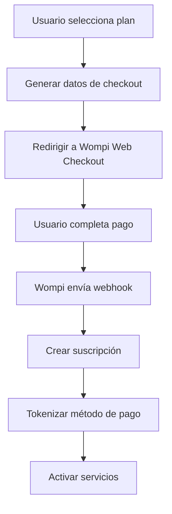

# Integración de Wompi - Sistema de Suscripciones

## Descripción General

Este documento describe la implementación completa del sistema de suscripciones con Wompi como pasarela de pago. El sistema incluye Web Checkout, tokenización de métodos de pago, cobros recurrentes automáticos y un panel de gestión completo.

## Arquitectura del Sistema

### Componentes Principales

1. **Base de Datos**: Tablas para planes, suscripciones, métodos de pago, facturas y transacciones
2. **API de Wompi**: Cliente HTTP para interactuar con la API de Wompi
3. **Endpoints de API**: APIs para checkout, gestión de suscripciones y webhooks
4. **Panel de UI**: Componentes React para gestión de billing
5. **Cron Jobs**: Sistema de cobros recurrentes y reintentos automáticos
6. **Webhooks**: Procesamiento automático de eventos de Wompi

### Flujo de Suscripción



## Configuración

### Variables de Entorno

```bash
# Wompi Configuration
WOMPI_ENVIRONMENT=sandbox
NEXT_PUBLIC_WOMPI_PUBLIC_KEY=pub_test_xxxxx
WOMPI_PRIVATE_KEY=prv_test_xxxxx
WOMPI_INTEGRITY_SECRET=test_integrity_xxxxx
WOMPI_WEBHOOK_SECRET=webhook_secret_xxxxx
NEXT_PUBLIC_WOMPI_BASE_URL=https://sandbox.wompi.co

# Billing Configuration
NEXT_PUBLIC_BILLING_ENABLED=true
NEXT_PUBLIC_APP_URL=http://localhost:3000
WOMPI_CRON_SECRET=cron_secret_xxxxx
```

### Configuración de Webhooks en Wompi

1. Accede al dashboard de Wompi
2. Ve a "Desarrolladores" > "Webhooks"
3. Configura la URL: `https://tudominio.com/api/webhooks/wompi`
4. Selecciona el evento: `transaction.updated`
5. Copia el secreto del webhook a `WOMPI_WEBHOOK_SECRET`

### Configuración de Cron Jobs en Vercel

1. Ve a tu proyecto en Vercel
2. Configura las siguientes tareas cron:

```json
{
  "crons": [
    {
      "path": "/api/cron/billing",
      "schedule": "0 0 * * *"
    },
    {
      "path": "/api/cron/dunning", 
      "schedule": "0 2 * * *"
    }
  ]
}
```

## Estructura de Base de Datos

### Tablas Principales

#### `plans`
- Almacena los planes de suscripción disponibles
- Campos: id, name, description, amount_in_cents, currency, features

#### `subscriptions`
- Gestiona las suscripciones de usuarios
- Campos: id, workspace_id, user_id, plan_id, status, current_period_start, current_period_end

#### `payment_sources`
- Almacena métodos de pago tokenizados
- Campos: id, workspace_id, wompi_id, type, status, customer_email, is_default

#### `invoices`
- Registro de facturas generadas
- Campos: id, subscription_id, amount_in_cents, status, period_start, period_end

#### `transactions`
- Historial de transacciones con Wompi
- Campos: id, invoice_id, wompi_id, amount_in_cents, status, raw_payload

## API Endpoints

### `/api/billing/plans`
- **GET**: Lista todos los planes disponibles

### `/api/billing/checkout`
- **POST**: Genera datos para Web Checkout de Wompi
- Input: `{ plan_id, workspace_id }`
- Output: Datos del formulario para redirigir a Wompi

### `/api/billing/subscriptions`
- **GET**: Obtiene suscripción del workspace
- **POST**: Crea nueva suscripción tras pago exitoso
- **PATCH**: Cancela o reactiva suscripción

### `/api/billing/payment-sources`
- **GET**: Lista métodos de pago del workspace
- **POST**: Agrega nuevo método de pago
- **DELETE**: Elimina método de pago
- **PATCH**: Establece método como predeterminado

### `/api/billing/invoices`
- **GET**: Lista facturas del workspace con paginación

### `/api/webhooks/wompi`
- **POST**: Recibe eventos de transacciones de Wompi
- Procesa automáticamente pagos exitosos y fallidos

## Componentes de UI

### `PlanSelector`
- Muestra los planes disponibles
- Permite seleccionar plan para suscripción
- Indica plan actual si existe

### `WompiCheckout`
- Genera formulario para redirigir a Wompi
- Maneja estados de carga y error
- Redirige automáticamente tras selección

### `CurrentSubscription`
- Muestra detalles de suscripción actual
- Permite cancelar o reactivar suscripción
- Indica estado y próxima fecha de cobro

### `PaymentMethods`
- Lista métodos de pago guardados
- Permite establecer método predeterminado
- Permite eliminar métodos de pago

### `InvoiceHistory`
- Muestra historial de facturas
- Permite descargar facturas
- Filtros por estado y fecha

## Sistema de Cobros Recurrentes

### Cron de Billing (`/api/cron/billing`)
- Ejecuta diariamente a las 00:00 UTC
- Busca suscripciones que vencen hoy
- Crea transacciones automáticas en Wompi
- Extiende período de suscripción

### Cron de Dunning (`/api/cron/dunning`)
- Ejecuta diariamente a las 02:00 UTC
- Reintenta pagos fallidos (máximo 3 intentos)
- Suspende suscripciones tras 3 fallos
- Envía notificaciones por email

## Seguridad

### Validación de Firmas
- Todas las transacciones incluyen firma de integridad SHA256
- Los webhooks se validan con HMAC-SHA256
- Los cron jobs requieren token de autorización

### Protección de Datos
- Los métodos de pago se tokenizan en Wompi
- Solo se almacenan IDs de referencia
- Datos sensibles nunca se exponen en el frontend

## Testing

### Ambiente de Pruebas
- Usa credenciales de sandbox de Wompi
- Tarjetas de prueba disponibles en documentación de Wompi
- Webhooks de prueba para validar flujo completo

### Casos de Prueba
1. Suscripción nueva exitosa
2. Pago rechazado
3. Cobro recurrente exitoso
4. Cobro recurrente fallido
5. Cancelación de suscripción
6. Cambio de método de pago

## Monitoreo y Logs

### Logs Importantes
- Creación de transacciones en Wompi
- Procesamiento de webhooks
- Ejecución de cron jobs
- Errores de pago y reintentos

### Métricas Clave
- Tasa de éxito de pagos
- Tiempo de procesamiento de webhooks
- Número de reintentos por suscripción
- Suscripciones suspendidas

## Troubleshooting

### Problemas Comunes

#### Webhook no se recibe
- Verificar URL configurada en dashboard de Wompi
- Comprobar que el endpoint esté accesible públicamente
- Revisar logs del servidor para errores

#### Transacciones no se procesan
- Verificar configuración de variables de entorno
- Comprobar firma de integridad
- Revisar logs de la API de Wompi

#### Cron jobs no ejecutan
- Verificar configuración en Vercel
- Comprobar token de autorización
- Revisar logs de ejecución

### Comandos de Diagnóstico

```bash
# Verificar configuración de Wompi
curl -H "Authorization: Bearer $WOMPI_PRIVATE_KEY" \
  https://sandbox.wompi.co/v1/merchants

# Probar webhook localmente
ngrok http 3000
# Usar URL de ngrok en dashboard de Wompi

# Verificar cron jobs
curl -H "Authorization: Bearer $WOMPI_CRON_SECRET" \
  https://tudominio.com/api/cron/billing
```

## Checklist de Producción

### Antes del Deploy
- [ ] Variables de entorno configuradas con llaves de producción
- [ ] Webhook URL configurada en dashboard de Wompi
- [ ] Cron jobs configurados en Vercel
- [ ] Tests de integración completados
- [ ] Monitoreo configurado

### Post-Deploy
- [ ] Probar transacción real con tarjeta de prueba
- [ ] Verificar procesamiento de webhook
- [ ] Confirmar ejecución de cron jobs
- [ ] Monitorear logs por 24 horas
- [ ] Validar emails de notificación

## Soporte

Para problemas técnicos:
1. Revisar logs del sistema
2. Consultar documentación de Wompi
3. Contactar soporte técnico con detalles específicos

## Changelog

### v1.0.0 (2025-01-25)
- Implementación inicial del sistema de suscripciones
- Integración completa con Wompi Web Checkout
- Sistema de cobros recurrentes automáticos
- Panel de gestión de billing
- Sistema de webhooks para procesamiento automático


